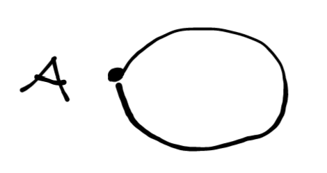

Do you like group theory?

I'd like to start a series of expository blog posts that "climb up the chain" of the dihedral groups of order $$2n$$ (as in, what do these groups visually look like as we vary $$n$$ from $$1$$ to $$n$$) in way more detail than what I've found in textbooks and other online resources. 

A danger to this is many people will find this exercise uninteresting since the dihedral group (in particular $$D_8$$, the group of symmetries of the square under reflection and rotation) is one of the first examples of groups in a ton of textbooks, but I have yet to find a comprehensive walkthrough of the first few $$n$$ for $$D_{2n}$$.

First, let's name names: When I say $$D_{2n}$$ I mean the group of symmetries of the $$n$$-gon in Euclidian space under the operations of translation and reflection. I'm sure we've all been presented with pictures of polygons as children and been asked to count its symmetries. Well, the formal presentation of these groups is just like that, except we're going to find additional sub-structure on these symmetries in the form of subgroups. 

That's what the interesting question here is: Given a dihedral group, what are its subgroups?
I hope to build up to this fairly quickly, at least as fast as I'm presenting them. 

Let's start. 

## $$D_2$$ - Dihedral Group of Order 2

Here we start with the case that $$n=1$$, so $$D_{2n}$$ = $$D_2$$. 

This the group of the symmetries of the $$1$$-sided polygon in Euclidian Space, under the operations of reflection or rotation. 

The only possible move here is to "switch the vertices", or reflect across the midpoint of the polygon. Equivalently, you can rotate the line $$180$$ degrees and get the same symmetry. In either case, let's call the operation "switching the vertices".

So, the group $$G = D_{2n} $$ looks like the set of these two symmetries:

<!--  -->

And the binary operations of this group are reflection/rotation as described above, and identity (leaving the $$1$$-sided polygon as is).

They also call $D_{2}$ the symmetry group of the line segment. Some sources may call it $$D_1$$ in favor of the geometric convention. 

## What About Subgroups?

By Langrage's Theorem, we have that the order of any possible subgroups must divide the order of the group. So the only possible subgroups have orders $1,2$.

<!-- Trivial subgroup of identity -->

## A Note on the $1$ sided polygon

In Artin's *Algebra*, he describes the 1-gon as a single node with a loop. Like so, 

<!--  -->

