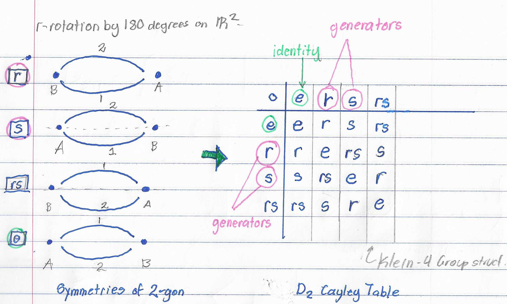

Let's continue our journey on the Dihedral groups of order $$2n$$.

First, let's establish a few things:

## A Note On Symmetry - Just Isometry

As we go through these groups, we're playing the game, what motions of the polygon leave the polygon looking the same (what are its symmetries)?

Reconsider "symmetry" as a manipulation of the plane. Then you can rephrase the game of looking for symmetries as looking for *isometries* of the plane. 

## $$D_4$$, the $$2$$-sided polygon

This group is the case when $$n=2$$, then the total order of the group is $$4$$. The operations are still identity, reflection, and rotation. 

It is important to note that this $$2$$-gon has 2 vertices and 2 edges, meaning the two vertices do NOT share an edge, unlike the $$1$$-sided polygon. While I draw them as curved edges, this is only a representation of otherwise very close straight lines. 

This group is isomorphic to the Klein 4-group, this also means that the group is isomorphic to the cyclic group of order 2 :) 

<!-- establish isomorphism for klein 4 group-->

<!-- establish isomorphism for cyclic group of order 2 -->

