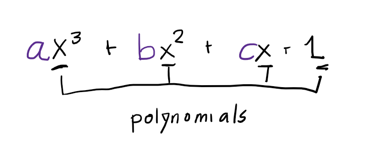
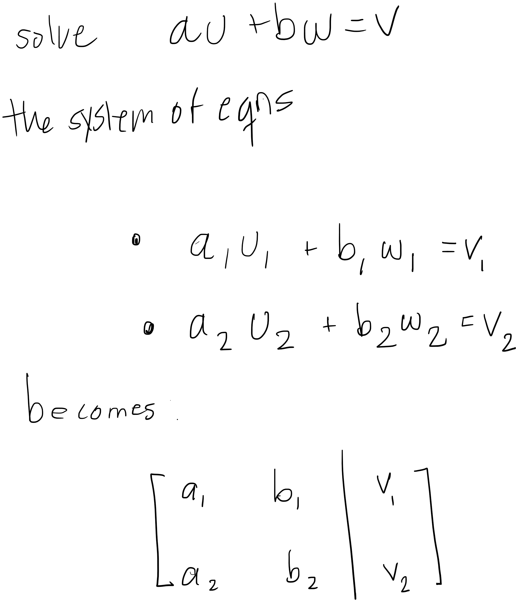

# Span and Linear Dependence

Understanding span and linear dependence are foundational to a mastery of linear algebra and finite dimensional vector spaces. 

To build up to these notions I will first define what a linear combination in in math language and in Python to provide an **unambiguous example**. 

## Linear Combinations

### What does the mathematical definition say?

- a linear combination  (or linear span) of a list of vectors, $(v_1, \dots v_m)$, is **itself a vector** of the form $a_1v_1 + \dots, + a_mv_m$ where $a_1, \dots, a_m$ are in the field $F$.

### Specify an example using Python logic:

If I wanted to express the same idea in Python with a finite example, I would write: 

```python
import numpy as np 
import pdb
import math

# three vectors from R**2
v_1 = np.array([2,3])

v_2 = np.array([5,7])

# v_2 = [5,7]
# print(v_2 * 7)
# Look out - don't do this (don't set )! will just make multiple copies of your list. 

v_3 = np.array([9,11])

# three scalars from R
a_1, a_2, a_3 = 1,2,3

vectors = [v_1, v_2, v_3]
scalars = [a_1, a_2, a_3]

linear_combination_terms = []

for vec_index in range(len(vectors)):
    linear_combination_terms.append(vectors[vec_index] * scalars[vec_index]) # compute terms in order

# then a linear combination of v_1, v_2, v_3 with a_1, a_2, and a_3 is:
linear_combination = sum(linear_combination_terms) # add them all together

# this could have been done in the for loop but better for clarity done here 

print(linear_combination)
```

### Generalization 

You can generalize the definition of a linear combination to vectors of any vector space. 

For example, note that from the definition, you can form linear combinations of polynomials and matrices, like so:



Since $$x^3, x^2, x, 1$$
are all polynomials, this is **also a linear combination** of polynomials.  

### Can I Tell if $v$ is a linear combination of $u$ and $w$?

How can I tell if a vector is a linear combination of another list of vectors?

>Determine if the system of equations representing the vectors has a solution

Then the question becomes: can you specify an algorithm for this? Can we write it down? In mathematical language? What about in code?

You can "cheat" at first and just tell whether a vector is a linear combination of other vectors with some mental math. 

You need a general way to do this however, and the way to do this pops out at you as the matrix formed by the equation $$
v = au + bw
$$




Then the task is easy. If the system has no solutions, $$v$$ is not a linear combination of $$u,w$$. 

